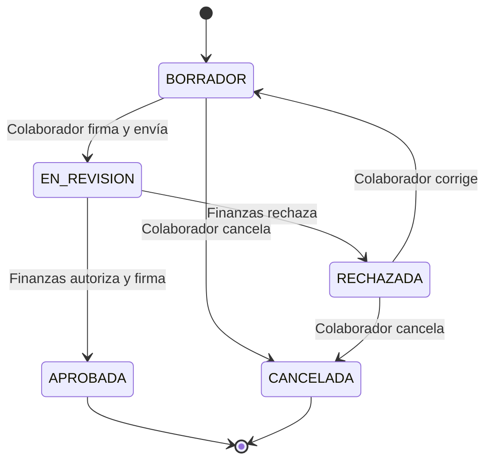
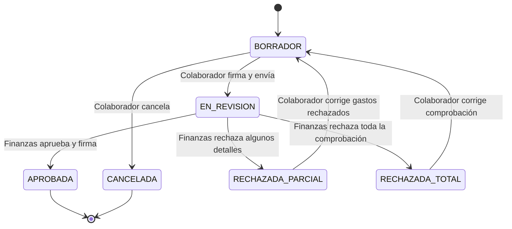
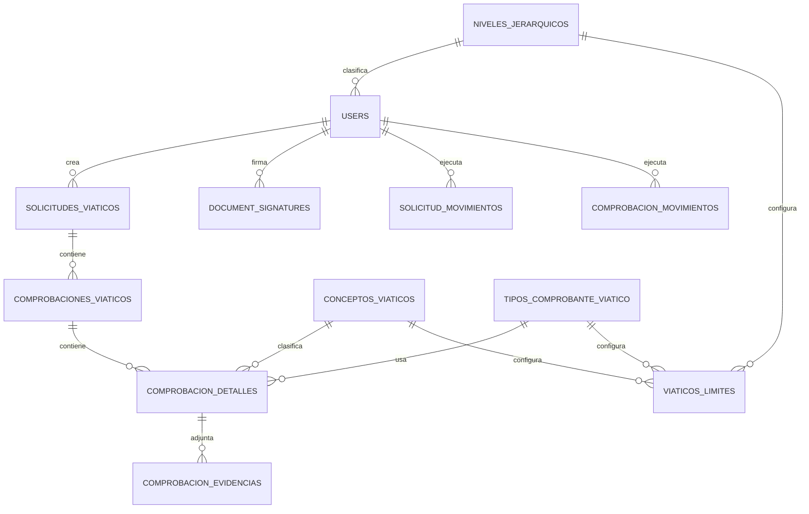
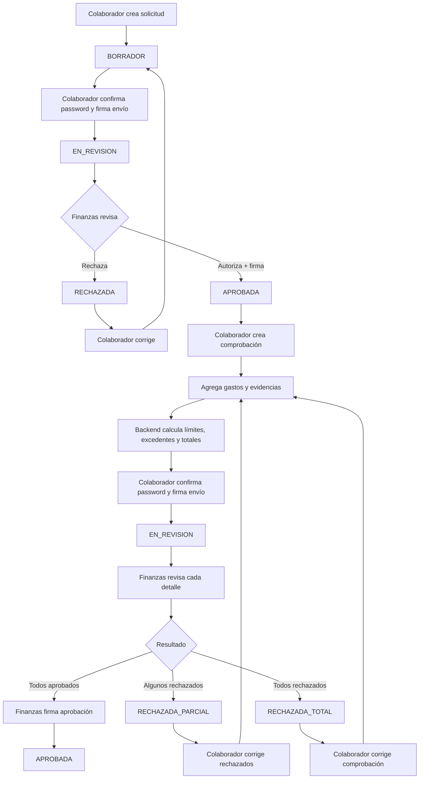

# MVP API de Viáticos en Laravel

> Documento funcional y técnico para implementación con Codex + Laravel Boost.
>
> Proyecto: `viaticos-api`
> Alcance: API REST para solicitudes y comprobaciones de viáticos.
> Framework objetivo: Laravel 13.

---

## 1. Objetivo

Construir un Producto Mínimo Viable (MVP) de un módulo de viáticos utilizando Laravel como API principal.

El MVP debe cubrir el flujo completo mínimo de:

1. Autenticación de usuarios.
2. Creación de una solicitud de viáticos por un colaborador.
3. Firma electrónica interna y envío de la solicitud a Finanzas.
4. Autorización o rechazo de la solicitud por Finanzas.
5. Creación de una o varias comprobaciones únicamente sobre una solicitud previamente autorizada.
6. Registro de gastos y evidencias de cada comprobación.
7. Aplicación de límites por concepto y nivel jerárquico.
8. Cálculo de excedentes.
9. Firma electrónica interna y envío de la comprobación a Finanzas.
10. Revisión, rechazo parcial/total o autorización de la comprobación por Finanzas.
11. Auditoría completa de cambios de estado y firmas.

La arquitectura deberá quedar preparada para integrar posteriormente:

- OCR de tickets y comprobantes.
- Lectura automática de CFDI/XML.
- Workflows con n8n u otra herramienta.
- Notificaciones por correo, Teams, Slack o WhatsApp.
- Generación de PDF.
- Firma con certificados externos/e.firma si el proyecto lo requiere.
- Almacenamiento S3-compatible.

Estas integraciones futuras **no deben bloquear la construcción del MVP base**.

---

## 2. Decisiones de alcance del MVP

### 2.1 Perfiles

Solo existirán dos perfiles funcionales:

| Perfil | Descripción |
|---|---|
| `COLABORADOR` | Crea, firma y envía sus solicitudes y comprobaciones. |
| `FINANZAS` | Revisa, autoriza o rechaza solicitudes y comprobaciones. |

No crear perfiles separados de Contabilidad, Contraloría, jefe inmediato u otros autorizadores en esta primera versión.

### 2.2 No existe comprobación de reembolso sin solicitud

En este MVP **toda comprobación debe pertenecer a una solicitud de viáticos previamente autorizada**.

No implementar el flujo denominado anteriormente `comprobacion_reembolso`.

Regla obligatoria:

```text
Solicitud APROBADA
        ↓
Puede crear comprobación

Solicitud diferente de APROBADA
        ↓
No puede crear comprobación
```

### 2.3 Una solicitud puede tener N comprobaciones

Mantener la relación:

```text
SOLICITUD_VIATICOS 1 ─────── N COMPROBACIONES_VIATICOS
                                  │
                                  └──── 1 ───── N COMPROBACION_DETALLES
```

El colaborador puede dividir la comprobación de una misma solicitud en varias comprobaciones mientras respete las reglas de monto acumulado.

### 2.4 Sin desautorización en el MVP

Para reducir el alcance inicial, no implementar el estado `DESAUTORIZADA` ni acciones para revertir una aprobación.

Si después se necesita, deberá agregarse como un flujo administrativo separado y auditado.

### 2.5 Firma utilizada en el MVP

El MVP implementará una **firma electrónica interna con trazabilidad y sello de integridad**.

No debe presentarse como equivalente jurídico a una e.firma del SAT o a una firma electrónica avanzada basada en un certificado X.509.

La arquitectura deberá permitir agregar un proveedor criptográfico/certificado posteriormente.

---

## 3. Tecnologías y convenciones Laravel

Usar las capacidades estándar del framework antes de agregar dependencias externas.

### Base

- Laravel 13.
- PHP compatible con Laravel 13.
- MySQL/MariaDB para persistencia.
- Laravel Sanctum para autenticación de la API.
- Eloquent ORM.
- Form Requests para validación.
- API Resources para respuestas.
- Policies para autorización por recurso.
- PHP Enums para roles, estados y tipos controlados.
- Services/Actions para reglas de negocio.
- Events/Listeners para desacoplar acciones secundarias.
- Queues para procesamiento futuro de OCR, PDFs y notificaciones.
- Laravel Storage para archivos.
- Pest para pruebas.
- Pint para formato.

### Instalación API

Si Sanctum todavía no está instalado/configurado:

```bash
php artisan install:api
```

Para el MVP y pruebas con Postman/Codex se pueden utilizar tokens Bearer de Sanctum.

Si posteriormente el frontend es una SPA propia de primera parte, evaluar la autenticación SPA basada en cookies de Sanctum en vez de entregar tokens persistentes al navegador.

### Laravel Boost / Codex

Antes de generar grandes cantidades de código:

1. Ejecutar la skill `infer-conventions` sobre el proyecto.
2. Respetar las convenciones detectadas.
3. Usar las skills instaladas de Laravel Boost cuando corresponda:
   - `laravel-best-practices`
   - `testing-best-practices`
4. No generar frontend/Tailwind en esta etapa salvo que se solicite explícitamente.

---

## 4. Principios de arquitectura

El controlador HTTP no debe contener reglas de negocio complejas.

Flujo recomendado:

```text
Route
  ↓
Controller
  ↓
FormRequest
  ↓
Policy
  ↓
Action / Service
  ↓
Eloquent Models + DB Transaction
  ↓
Domain Event
  ↓
Listeners / Jobs
```

Ejemplo:

```text
POST /api/v1/solicitudes/{id}/enviar
        ↓
EnviarSolicitudRequest
        ↓
SolicitudViaticoPolicy::submit()
        ↓
EnviarSolicitudAction
        ↓
DB::transaction()
        ├── validar estado
        ├── crear firma
        ├── cambiar estado
        ├── registrar movimiento
        └── dispatch SolicitudEnviada
```

### Regla de desacoplamiento

OCR, n8n, correo y generación de PDF no deben ser llamados directamente desde un Controller.

Usar contratos, Events, Listeners y/o Jobs para que dichas integraciones puedan habilitarse o reemplazarse sin modificar el flujo principal.

---

# 5. Modelo de dominio

## 5.1 Usuario

Usar la tabla `users` de Laravel y agregar únicamente la información necesaria para el MVP.

Campos sugeridos adicionales:

| Campo | Tipo | Regla |
|---|---|---|
| `role` | varchar(30) | `COLABORADOR` o `FINANZAS`. |
| `employee_code` | varchar(50), nullable | Identificador externo del colaborador. |
| `area` | varchar(150), nullable | Área actual. |
| `puesto` | varchar(150), nullable | Puesto actual. |
| `nivel_jerarquico_id` | FK nullable | Necesario para calcular límites. |
| `is_active` | boolean | Usuario habilitado. |

Enum:

```php
enum UserRole: string
{
    case COLABORADOR = 'COLABORADOR';
    case FINANZAS = 'FINANZAS';
}
```

No instalar un paquete de roles/permisos únicamente para manejar estos dos perfiles.

---

## 5.2 Niveles jerárquicos

Tabla: `niveles_jerarquicos`

| Campo | Tipo |
|---|---|
| `id` | bigint unsigned |
| `nombre` | varchar(50) |
| `orden` | unsigned integer |
| `is_active` | boolean |
| timestamps | Laravel |

Seeder inicial:

```text
1er Nivel
2do Nivel
3er Nivel
```

Relación:

```text
NivelJerarquico 1 ───── N User
```

---

## 5.3 Conceptos de viáticos

Tabla: `conceptos_viaticos`

Campos:

| Campo | Tipo | Descripción |
|---|---|---|
| `id` | bigint unsigned | PK |
| `clave` | varchar(30), unique | Identificador estable |
| `nombre` | varchar(100) | Nombre visible |
| `unidad` | varchar(30) | `DIA`, `NOCHE`, `EVENTO` |
| `tiene_limite` | boolean | Define si debe buscarse límite. |
| `diferencia_tipo_comprobante` | boolean | Define si el límite depende de factura/vale. |
| `is_active` | boolean | Catálogo activo |
| timestamps | Laravel | |

Seeder inicial:

| Clave | Unidad | Tiene límite | Distingue tipo comprobante |
|---|---|---:|---:|
| `HOSPEDAJE` | `NOCHE` | Sí | No |
| `DESAYUNO` | `DIA` | Sí | Sí |
| `COMIDA` | `DIA` | Sí | Sí |
| `CENA` | `DIA` | Sí | Sí |
| `TRANSPORTE` | `EVENTO` | No | No |
| `EXTRAORDINARIO` | `EVENTO` | No | No |

Regla importante:

`TRANSPORTE` y `EXTRAORDINARIO` no deben tener registros artificiales con límite cero o un monto muy alto.

```text
tiene_limite = false
```

es lo que representa explícitamente que son ilimitados.

---

## 5.4 Tipos de comprobante

Tabla: `tipos_comprobante_viatico`

Seeder:

| Clave | Nombre |
|---|---|
| `FACTURA` | Con factura |
| `VALE_AZUL` | Sin factura / Vale Azul |
| `NO_APLICA` | No aplica para cálculo diferenciado |

---

## 5.5 Límites de viáticos

Tabla: `viaticos_limites`

Campos:

| Campo | Tipo |
|---|---|
| `id` | bigint unsigned |
| `nivel_jerarquico_id` | FK |
| `concepto_id` | FK |
| `tipo_comprobante_id` | FK |
| `monto_maximo` | decimal(12,2) |
| `is_active` | boolean |
| timestamps | Laravel |

Índice único:

```text
nivel_jerarquico_id + concepto_id + tipo_comprobante_id
```

### Reglas

Si:

```text
concepto.tiene_limite = false
```

entonces:

```text
limite_aplicado = null
excedente = 0
```

Si:

```text
concepto.tiene_limite = true
```

pero no existe configuración aplicable en `viaticos_limites`, el backend debe devolver un error de configuración y no tratar el concepto como ilimitado.

Si:

```text
concepto.diferencia_tipo_comprobante = true
```

buscar límite por:

```text
nivel + concepto + tipo_comprobante
```

Si es `false`, utilizar la configuración `NO_APLICA`.

---

# 6. Solicitud de viáticos

## 6.1 Tabla `solicitudes_viaticos`

Campos sugeridos:

| Campo | Tipo | Descripción |
|---|---|---|
| `id` | bigint unsigned | PK |
| `user_id` | FK users | Propietario/colaborador |
| `area` | varchar(150) | Snapshot al crear solicitud |
| `puesto` | varchar(150) | Snapshot al crear solicitud |
| `lugar` | varchar(255) | Destino |
| `motivo` | text | Motivo del viaje |
| `fecha_inicio` | date | Inicio |
| `fecha_fin` | date | Fin |
| `importe_solicitado` | decimal(12,2) | Monto solicitado |
| `importe_autorizado` | decimal(12,2), nullable | Definido/confirmado por Finanzas |
| `status` | varchar(30) | Enum |
| `motivo_rechazo` | text nullable | Último rechazo |
| `submitted_at` | timestamp nullable | Último envío |
| `approved_at` | timestamp nullable | Aprobación |
| `approved_by` | FK users nullable | Usuario Finanzas |
| timestamps | Laravel | |

Usar `decimal`, nunca `float`, para importes monetarios.

## 6.2 Enum de estado

```php
enum SolicitudStatus: string
{
    case BORRADOR = 'BORRADOR';
    case EN_REVISION = 'EN_REVISION';
    case APROBADA = 'APROBADA';
    case RECHAZADA = 'RECHAZADA';
    case CANCELADA = 'CANCELADA';
}
```

## 6.3 Máquina de estados



### Reglas

- Solo el propietario puede modificar una solicitud `BORRADOR`.
- Una solicitud `EN_REVISION` es inmutable para el colaborador.
- Finanzas solo puede autorizar/rechazar solicitudes `EN_REVISION`.
- El rechazo exige `motivo_rechazo`.
- Una solicitud `APROBADA` no se edita en el MVP.
- La comprobación solo puede crearse desde `APROBADA`.
- `fecha_fin >= fecha_inicio`.
- `importe_solicitado > 0`.
- Al autorizar, `importe_autorizado > 0`.

---

# 7. Comprobaciones de viáticos

## 7.1 Tabla `comprobaciones_viaticos`

Campos sugeridos:

| Campo | Tipo | Descripción |
|---|---|---|
| `id` | bigint unsigned | PK |
| `solicitud_id` | FK | Solicitud origen |
| `user_id` | FK users | Colaborador |
| `status` | varchar(30) | Estado |
| `fecha_comprobacion` | date | Fecha de creación/comprobación |
| `total_importe` | decimal(12,2) | Sumatoria |
| `total_iva` | decimal(12,2) | Sumatoria |
| `total_retencion` | decimal(12,2) | Sumatoria |
| `total_propina` | decimal(12,2) | Sumatoria |
| `total` | decimal(12,2) | Total comprobado |
| `total_excedente` | decimal(12,2) | Total excedente |
| `observaciones` | text nullable | General |
| `motivo_rechazo` | text nullable | Rechazo total |
| `submitted_at` | timestamp nullable | Último envío |
| `approved_at` | timestamp nullable | Aprobación |
| `approved_by` | FK users nullable | Usuario Finanzas |
| timestamps | Laravel | |

Los totales de cabecera deben ser recalculados por backend a partir de los detalles. El cliente no es fuente de verdad para los totales.

## 7.2 Enum de estado

```php
enum ComprobacionStatus: string
{
    case BORRADOR = 'BORRADOR';
    case EN_REVISION = 'EN_REVISION';
    case APROBADA = 'APROBADA';
    case RECHAZADA_PARCIAL = 'RECHAZADA_PARCIAL';
    case RECHAZADA_TOTAL = 'RECHAZADA_TOTAL';
    case CANCELADA = 'CANCELADA';
}
```

## 7.3 Máquina de estados



### Decisión sobre `RECHAZADA_TOTAL`

En este MVP se permitirá corregir una comprobación totalmente rechazada en vez de obligar al usuario a crear otro registro. Esto conserva la trazabilidad y reduce duplicados.

Si negocio decide posteriormente que el rechazo total debe cerrar definitivamente la comprobación, la transición puede cambiarse sin alterar la estructura principal.

---

# 8. Detalle de comprobación

## 8.1 Tabla `comprobacion_detalles`

Campos:

| Campo | Tipo | Descripción |
|---|---|---|
| `id` | bigint unsigned | PK |
| `comprobacion_id` | FK | Cabecera |
| `fecha_gasto` | date | Día del gasto |
| `concepto_id` | FK | Concepto catálogo |
| `tipo_comprobante_id` | FK | Factura/Vale/No aplica |
| `descripcion` | varchar(255), nullable | Descripción libre |
| `razon_social` | varchar(255), nullable | Emisor |
| `rfc` | varchar(13), nullable | RFC emisor |
| `numero_factura` | varchar(100), nullable | Folio |
| `uuid_cfdi` | varchar(50), nullable | UUID CFDI |
| `importe` | decimal(12,2) | Base |
| `iva` | decimal(12,2) | IVA |
| `retencion` | decimal(12,2) | Retención |
| `propina` | decimal(12,2) | Propina |
| `total` | decimal(12,2) | Total del gasto |
| `limite_aplicado` | decimal(12,2), nullable | Snapshot del límite |
| `excedente` | decimal(12,2) | Calculado |
| `estado_revision` | varchar(30) | Enum |
| `motivo_rechazo` | text nullable | Obligatorio al rechazar |
| `revisado_por` | FK users nullable | Finanzas |
| `fecha_revision` | timestamp nullable | Revisión |
| `origen_captura` | varchar(20) | `MANUAL`, `XML`, `OCR` |
| `metadata_extraccion` | json nullable | Datos técnicos del extractor |
| timestamps | Laravel | |

Enum:

```php
enum DetalleRevisionStatus: string
{
    case PENDIENTE = 'PENDIENTE';
    case APROBADO = 'APROBADO';
    case RECHAZADO = 'RECHAZADO';
}
```

Enum preparado para integraciones:

```php
enum OrigenCaptura: string
{
    case MANUAL = 'MANUAL';
    case XML = 'XML';
    case OCR = 'OCR';
}
```

### Regla de revisión parcial

Al terminar la revisión:

```text
Todos APROBADO
    => comprobación APROBADA

Todos RECHAZADO
    => comprobación RECHAZADA_TOTAL

Mezcla APROBADO + RECHAZADO
    => comprobación RECHAZADA_PARCIAL
```

Cuando el colaborador edite un detalle previamente rechazado:

```text
RECHAZADO
   ↓ editar
PENDIENTE
```

Limpiar:

- `motivo_rechazo`
- `revisado_por`
- `fecha_revision`

Los detalles ya aprobados no deben ser modificados durante una corrección parcial.

---

# 9. Evidencias

## 9.1 Tabla `comprobacion_evidencias`

Una evidencia pertenece a un detalle.

Campos:

| Campo | Tipo |
|---|---|
| `id` | bigint unsigned |
| `detalle_id` | FK |
| `tipo` | varchar(30) |
| `original_name` | varchar(255) |
| `stored_name` | varchar(255) |
| `disk` | varchar(50) |
| `path` | varchar(500) |
| `mime_type` | varchar(100) |
| `size` | bigint unsigned |
| `sha256` | char(64) |
| timestamps | Laravel |

Tipos iniciales sugeridos:

```text
XML
PDF
IMAGEN
TICKET
OTRO
```

### Reglas de archivos

- Usar Laravel Storage.
- No guardar evidencias en una carpeta pública directamente.
- Usar nombres generados (UUID/ULID) y conservar el nombre original por separado.
- Validar MIME real y tamaño.
- Calcular SHA-256 del archivo para integridad/detección de duplicados.
- La descarga siempre debe pasar por Policy/autorización.
- El colaborador únicamente accede a evidencias propias.
- Finanzas puede acceder a evidencias de solicitudes/comprobaciones que debe revisar.

Regla del MVP:

Cada detalle debe tener al menos una evidencia antes de enviar la comprobación a revisión, salvo que posteriormente negocio defina excepciones por concepto.

---

# 10. Límites y excedentes

## 10.1 Snapshot del límite

`limite_aplicado` guarda el monto configurado que correspondía al momento de evaluar el gasto.

Esto evita que un cambio futuro del catálogo modifique históricamente comprobaciones ya procesadas.

### Concepto sin límite

```text
tiene_limite = false
limite_aplicado = null
excedente = 0
```

### Concepto con límite

El límite debe aplicarse por fecha/unidad según la configuración del concepto.

Para los conceptos diarios del MVP:

```text
acumulado = SUM(gastos aplicables del mismo viaje/solicitud,
                fecha,
                concepto,
                y tipo de comprobante cuando corresponda)

excedente_acumulado = MAX(acumulado - limite, 0)
```

## 10.2 Regla anti-fragmentación

El cálculo no debe limitarse únicamente a la comprobación actual.

Como una solicitud puede tener N comprobaciones, los gastos del mismo día/concepto deben acumularse a nivel de **solicitud de viáticos**, de lo contrario un usuario podría dividir el mismo gasto entre dos comprobaciones y evitar el límite.

Ejemplo:

```text
Solicitud #150
Límite COMIDA / 2026-09-10 = $500

Comprobación A -> COMIDA = $300
Comprobación B -> COMIDA = $350

Acumulado = $650
Excedente acumulado = $150
```

El servicio de cálculo deberá distribuir/calcular el excedente de forma determinista. Para el MVP se puede asignar al detalle actual el excedente incremental:

```text
excedente_detalle =
    max(acumulado_incluyendo_detalle - limite, 0)
    - max(acumulado_antes_del_detalle - limite, 0)
```

Nunca permitir excedentes negativos.

## 10.3 Qué comprobaciones cuentan para acumulados

Para el control de monto autorizado y límites, contar comprobaciones activas/históricas válidas y excluir únicamente:

```text
CANCELADA
```

En el caso de una comprobación `RECHAZADA_TOTAL` que será corregida y reenviada, no debe duplicarse su monto porque sigue siendo el mismo registro.

Si posteriormente `RECHAZADA_TOTAL` se vuelve un estado terminal, entonces se podrá excluir del acumulado.

## 10.4 Importe autorizado de la solicitud

La suma total de las comprobaciones de una solicitud no debe superar el `importe_autorizado` sin una regla explícita de negocio.

Para el MVP:

```text
SUM(total de comprobaciones no canceladas) <= importe_autorizado
```

Si se quiere permitir capturar más gasto pero marcarlo como excedente general, deberá definirse como cambio de alcance. No asumirlo automáticamente.

Usar `DB::transaction()` y, cuando se crea/envía una comprobación, bloquear la solicitud (`lockForUpdate`) para evitar que dos peticiones concurrentes excedan el monto autorizado.

---

# 11. Firmas electrónicas internas

## 11.1 Objetivo

Registrar de forma auditable quién aceptó/envió o autorizó un documento y garantizar que la firma quede vinculada a una versión concreta de sus datos.

Firmas requeridas:

| Documento | Acción | Firma |
|---|---|---|
| Solicitud | Envío a revisión | Colaborador |
| Solicitud | Aprobación | Finanzas |
| Comprobación | Envío a revisión | Colaborador |
| Comprobación | Aprobación | Finanzas |

El rechazo no requiere firma, pero sí usuario, fecha y motivo en auditoría.

## 11.2 Tabla genérica `document_signatures`

Usar una relación polimórfica con solicitud/comprobación.

Campos:

| Campo | Tipo | Descripción |
|---|---|---|
| `id` | bigint unsigned | PK |
| `signable_type` | morph | Clase documento |
| `signable_id` | morph | ID documento |
| `user_id` | FK users | Firmante |
| `action` | varchar(30) | `ENVIO` / `APROBACION` |
| `method` | varchar(30) | Inicialmente `INTERNAL_CONFIRMATION` |
| `version` | unsigned integer | Número de versión firmada |
| `payload_snapshot` | json | Snapshot inmutable de datos firmados |
| `content_hash` | char(64) | SHA-256 del snapshot canónico |
| `signature_hash` | char(64) | Sello HMAC del servidor |
| `ip_address` | varchar(45), nullable | Auditoría |
| `user_agent` | text nullable | Auditoría |
| `signed_at` | timestamp | Fecha firma |
| timestamps | Laravel | |

Índice recomendado:

```text
signable_type + signable_id + version + action
```

## 11.3 Proceso de firma

Al enviar/aprobar:

1. Autorizar acción mediante Policy.
2. Solicitar confirmación de contraseña del usuario.
3. Validar `Hash::check()` contra el password actual.
4. Construir un snapshot canónico del documento.
5. Serializar el snapshot de forma determinista.
6. Calcular:

```text
content_hash = SHA256(snapshot_canonico)
```

7. Calcular sello interno:

```text
signature_hash = HMAC-SHA256(
    content_hash + user_id + action + version + signed_at,
    SIGNATURE_SECRET
)
```

8. Guardar firma y snapshot.
9. Cambiar estado en la misma transacción.
10. Registrar movimiento de auditoría.

Crear una clave separada en `.env`:

```text
SIGNATURE_SECRET=
```

No guardar la contraseña del usuario ni incluirla en el snapshot.

## 11.4 Versionado

Cada reenvío después de una corrección incrementa `version`.

Ejemplo:

```text
Comprobación #20 v1
  Colaborador firma ENVIO
  Finanzas rechaza parcialmente

Colaborador corrige

Comprobación #20 v2
  Colaborador firma ENVIO
  Finanzas firma APROBACION
```

Las firmas de v1 no se eliminan.

Esto conserva el historial completo y evita sobrescribir evidencia previa.

## 11.5 Snapshot de solicitud

Incluir al menos:

- id
- colaborador
- área/puesto snapshot
- lugar
- motivo
- fechas
- importe solicitado
- importe autorizado cuando aplique
- versión

## 11.6 Snapshot de comprobación

Incluir:

- id
- solicitud_id
- colaborador
- versión
- totales
- todos los detalles
- concepto
- tipo de comprobante
- importes
- límites aplicados
- excedentes
- hashes SHA-256 de evidencias

No incluir campos volátiles como `updated_at` si no forman parte del documento de negocio.

---

# 12. Auditoría de movimientos

Crear dos tablas para mantener el dominio simple:

- `solicitud_movimientos`
- `comprobacion_movimientos`

Campos comunes:

| Campo | Tipo |
|---|---|
| `id` | bigint unsigned |
| `*_id` | FK documento |
| `user_id` | FK users |
| `action` | varchar(50) |
| `from_status` | varchar(30), nullable |
| `to_status` | varchar(30), nullable |
| `comment` | text nullable |
| `metadata` | json nullable |
| `created_at` | timestamp |

No permitir update/delete funcional de movimientos desde la API.

Acciones ejemplo:

```text
CREATED
UPDATED
SUBMITTED
APPROVED
REJECTED
CANCELLED
DETAIL_REJECTED
DETAIL_CORRECTED
EVIDENCE_UPLOADED
SIGNED
```

---

# 13. Autorización con Policies

Crear al menos:

```text
SolicitudViaticoPolicy
ComprobacionViaticoPolicy
ComprobacionDetallePolicy
EvidenciaPolicy
```

## 13.1 Reglas del colaborador

Puede:

- listar únicamente sus solicitudes/comprobaciones;
- crear solicitud;
- editar solicitud en `BORRADOR`;
- corregir solicitud `RECHAZADA` llevándola a `BORRADOR`;
- cancelar solicitud cuando esté permitido;
- firmar/enviar su solicitud;
- crear comprobación solo de una solicitud propia `APROBADA`;
- editar gastos de comprobaciones en `BORRADOR`;
- editar únicamente detalles rechazados al corregir un rechazo parcial;
- subir/eliminar evidencia mientras el detalle sea editable;
- firmar/enviar comprobación;
- ver motivos de rechazo.

No puede:

- aprobar documentos;
- modificar límites/catálogos;
- acceder a documentos de otro colaborador;
- editar un documento `EN_REVISION` o `APROBADA`.

## 13.2 Reglas de Finanzas

Puede:

- listar solicitudes `EN_REVISION` y consultar histórico;
- ver solicitud y evidencias relacionadas;
- autorizar/rechazar solicitud;
- listar comprobaciones `EN_REVISION` y consultar histórico;
- aprobar/rechazar detalles;
- finalizar revisión como aprobación, rechazo parcial o total;
- descargar evidencias;
- consultar firmas y auditoría.

No puede:

- alterar detalles económicos directamente para “hacerlos cuadrar”;
- crear una comprobación como si fuera el colaborador;
- editar silenciosamente el documento enviado.

Si detecta un error, debe rechazarlo indicando motivo para que exista trazabilidad.

---

# 14. Endpoints REST propuestos

Prefijo:

```text
/api/v1
```

Todos los endpoints privados usan:

```text
auth:sanctum
```

## 14.1 Auth

```http
POST   /api/v1/auth/login
POST   /api/v1/auth/logout
GET    /api/v1/auth/me
```

Login MVP:

```json
{
  "email": "colaborador@example.com",
  "password": "secret"
}
```

Respuesta:

```json
{
  "data": {
    "user": {},
    "token": "..."
  }
}
```

## 14.2 Catálogos

```http
GET /api/v1/catalogos/conceptos
GET /api/v1/catalogos/tipos-comprobante
GET /api/v1/catalogos/mis-limites
```

`mis-limites` obtiene límites a partir del nivel jerárquico del usuario autenticado.

## 14.3 Solicitudes - colaborador

```http
GET    /api/v1/solicitudes
POST   /api/v1/solicitudes
GET    /api/v1/solicitudes/{solicitud}
PATCH  /api/v1/solicitudes/{solicitud}
POST   /api/v1/solicitudes/{solicitud}/enviar
POST   /api/v1/solicitudes/{solicitud}/cancelar
GET    /api/v1/solicitudes/{solicitud}/movimientos
GET    /api/v1/solicitudes/{solicitud}/firmas
```

## 14.4 Solicitudes - Finanzas

```http
GET  /api/v1/finanzas/solicitudes
GET  /api/v1/finanzas/solicitudes/{solicitud}
POST /api/v1/finanzas/solicitudes/{solicitud}/aprobar
POST /api/v1/finanzas/solicitudes/{solicitud}/rechazar
```

Aprobar:

```json
{
  "importe_autorizado": 10000.00,
  "password": "confirmacion-del-firmante"
}
```

Rechazar:

```json
{
  "motivo": "Falta justificar el destino del viaje."
}
```

## 14.5 Comprobaciones - colaborador

```http
GET    /api/v1/comprobaciones
POST   /api/v1/solicitudes/{solicitud}/comprobaciones
GET    /api/v1/comprobaciones/{comprobacion}
PATCH  /api/v1/comprobaciones/{comprobacion}
POST   /api/v1/comprobaciones/{comprobacion}/enviar
POST   /api/v1/comprobaciones/{comprobacion}/cancelar
GET    /api/v1/comprobaciones/{comprobacion}/movimientos
GET    /api/v1/comprobaciones/{comprobacion}/firmas
```

## 14.6 Detalles

```http
POST   /api/v1/comprobaciones/{comprobacion}/detalles
GET    /api/v1/comprobaciones/{comprobacion}/detalles/{detalle}
PATCH  /api/v1/comprobaciones/{comprobacion}/detalles/{detalle}
DELETE /api/v1/comprobaciones/{comprobacion}/detalles/{detalle}
```

No permitir delete físico de detalles que ya formaron parte de una versión firmada. En correcciones posteriores usar edición controlada o un mecanismo de soft delete/versionado si se vuelve necesario.

## 14.7 Evidencias

```http
POST   /api/v1/comprobaciones/{comprobacion}/detalles/{detalle}/evidencias
GET    /api/v1/evidencias/{evidencia}/download
DELETE /api/v1/evidencias/{evidencia}
```

## 14.8 Comprobaciones - Finanzas

```http
GET  /api/v1/finanzas/comprobaciones
GET  /api/v1/finanzas/comprobaciones/{comprobacion}
POST /api/v1/finanzas/comprobaciones/{comprobacion}/detalles/{detalle}/aprobar
POST /api/v1/finanzas/comprobaciones/{comprobacion}/detalles/{detalle}/rechazar
POST /api/v1/finanzas/comprobaciones/{comprobacion}/finalizar-revision
```

Rechazar detalle:

```json
{
  "motivo": "El ticket no permite identificar el establecimiento."
}
```

Finalizar revisión aprobatoria debe solicitar password porque genera firma de Finanzas:

```json
{
  "password": "confirmacion-del-firmante"
}
```

El backend determina el estado final según el estado de los detalles; el cliente **no envía** `APROBADA`, `RECHAZADA_PARCIAL` o `RECHAZADA_TOTAL` como decisión arbitraria.

---

# 15. Respuesta estándar de API

Éxito:

```json
{
  "data": {},
  "message": "Operación realizada correctamente"
}
```

Colección:

```json
{
  "data": [],
  "meta": {
    "current_page": 1,
    "per_page": 20,
    "total": 100
  }
}
```

Error de negocio sugerido:

```json
{
  "message": "La comprobación solo puede crearse desde una solicitud aprobada.",
  "code": "SOLICITUD_NO_APROBADA",
  "errors": {}
}
```

Usar códigos HTTP apropiados:

```text
200 OK
201 Created
204 No Content
401 Unauthenticated
403 Forbidden
404 Not Found
409 Conflict -> transición inválida / conflicto de estado
422 Unprocessable Entity -> validación
```

---

# 16. Servicios / Actions sugeridos

Evitar un único `ViaticosService` gigantesco.

Separar por caso de uso.

## Solicitudes

```text
CreateSolicitudAction
UpdateSolicitudAction
SubmitSolicitudAction
ApproveSolicitudAction
RejectSolicitudAction
CancelSolicitudAction
```

## Comprobaciones

```text
CreateComprobacionAction
AddDetalleAction
UpdateDetalleAction
UploadEvidenciaAction
SubmitComprobacionAction
ReviewDetalleAction
FinalizeComprobacionReviewAction
CancelComprobacionAction
RecalculateComprobacionTotalsAction
```

## Reglas compartidas

```text
ResolveViaticoLimitService
CalculateExpenseExcessService
ValidateAuthorizedAmountService
DocumentSignatureService
DocumentSnapshotService
AuditService
```

Cada Action que modifique estado o montos relevantes debe ejecutarse dentro de una transacción.

---

# 17. Events para preparar workflows

Crear eventos de dominio desde el MVP aunque inicialmente tengan listeners sencillos.

```text
SolicitudSubmitted
SolicitudApproved
SolicitudRejected
ComprobacionSubmitted
ComprobacionApproved
ComprobacionRejectedPartially
ComprobacionRejectedTotally
DetalleRejected
DocumentSigned
EvidenceUploaded
```

Esto permitirá conectar posteriormente:

```text
Laravel Event
   ├── Notification Listener
   ├── n8n Webhook Listener
   ├── PDF Generation Job
   ├── OCR Job
   └── Audit/Analytics Listener
```

Las llamadas HTTP externas deben utilizar timeout, retry controlado y logging, y preferentemente ejecutarse en Queue para no bloquear la petición del usuario.

---

# 18. Preparación para OCR y CFDI/XML

No implementar OCR completo en la primera iteración de la API base.

La estructura sí debe quedar preparada.

## 18.1 Contrato

Definir una abstracción similar a:

```php
interface ReceiptExtractionService
{
    public function extract(UploadedFile|string $file): ReceiptExtractionResult;
}
```

Implementaciones futuras:

```text
ManualReceiptExtractionService
CfdiXmlExtractionService
GoogleVisionReceiptExtractionService
AzureDocumentIntelligenceService
TesseractReceiptExtractionService
Otro proveedor
```

La lógica de negocio no debe conocer el proveedor concreto.

## 18.2 Datos esperados de una extracción

Normalizar cuando estén disponibles:

```text
fecha
razon_social
rfc
numero_factura
uuid_cfdi
subtotal / importe
iva
retencion
total
texto_crudo
confidence
```

La información extraída por OCR es **propuesta de captura**, no verdad absoluta.

El colaborador debe poder revisar/corregir antes de enviar.

## 18.3 Endpoint futuro

Reservar conceptualmente:

```http
POST /api/v1/comprobaciones/{comprobacion}/extraer-comprobante
```

No es obligatorio implementarlo en la primera entrega.

---

# 19. Integración futura con n8n / workflows

No llamar n8n desde los controladores.

Crear posteriormente un listener, por ejemplo:

```text
SolicitudSubmitted
    ↓
DispatchWorkflowWebhookJob
    ↓
N8N_WEBHOOK_URL
```

Payload mínimo:

```json
{
  "event": "solicitud.submitted",
  "occurred_at": "2026-09-10T14:00:00-06:00",
  "data": {
    "solicitud_id": 123,
    "user_id": 10,
    "status": "EN_REVISION"
  }
}
```

Agregar firma/HMAC al webhook futuro para que n8n pueda verificar que proviene de la API.

Nunca enviar contraseñas, tokens de Sanctum u otros secretos al workflow.

---

# 20. Reglas de seguridad

1. Nunca confiar en `user_id`, `role`, totales, límites o excedentes enviados por el cliente.
2. Obtener al usuario desde `request()->user()`.
3. Policies en todos los recursos sensibles.
4. Validar archivos por MIME y tamaño.
5. Evidencias privadas.
6. Evitar nombres de archivo proporcionados por usuario como ruta final.
7. Usar hashes para evidencias y snapshots firmados.
8. Usar transacciones para cambios de estado.
9. Registrar en auditoría quién, cuándo y desde qué estado realizó la acción.
10. No permitir cambiar estados mediante un endpoint CRUD genérico.
11. Cada transición debe tener una Action específica.
12. Rate limit más estricto para login y endpoints de firma.
13. No exponer stack traces en producción.
14. No guardar secretos OCR/n8n en base de datos sin necesidad; usar `.env`/config/secrets.
15. Evitar `forceFill()` o mass assignment de campos de estado/auditoría desde input externo.

---

# 21. Índices y restricciones importantes

Agregar índices al menos en:

```text
solicitudes_viaticos.user_id
solicitudes_viaticos.status
solicitudes_viaticos.fecha_inicio
solicitudes_viaticos.fecha_fin

comprobaciones_viaticos.solicitud_id
comprobaciones_viaticos.user_id
comprobaciones_viaticos.status

comprobacion_detalles.comprobacion_id
comprobacion_detalles.fecha_gasto
comprobacion_detalles.concepto_id
comprobacion_detalles.uuid_cfdi

comprobacion_evidencias.detalle_id
comprobacion_evidencias.sha256

document_signatures(signable_type, signable_id)
document_signatures.user_id
```

Considerar `uuid_cfdi` único cuando el negocio confirme que un CFDI no puede utilizarse en más de un gasto. Para el MVP es preferible validar duplicados a nivel de servicio y generar una prueba específica antes de imponer una restricción global que pueda afectar escenarios legítimos.

---

# 22. Diagrama entidad-relación conceptual



`DOCUMENT_SIGNATURES` es polimórfica hacia `SolicitudViatico` o `ComprobacionViatico`, por lo que Mermaid se mantiene conceptual.

---

# 23. Flujo completo del MVP



---

# 24. Factories y Seeders

Codex debe crear seeders mínimos para desarrollar/probar sin depender de sistemas externos.

## Usuarios de ejemplo

No usar correos/contraseñas reales de la documentación legacy.

```text
colaborador@example.com / password
finanzas@example.com / password
```

Solo para entorno local/testing.

## Catálogos

Crear seeders para:

```text
NivelesJerarquicosSeeder
ConceptosViaticosSeeder
TiposComprobanteViaticoSeeder
ViaticosLimitesSeeder
DemoUsersSeeder
```

---

# 25. Pruebas obligatorias con Pest

La API no se considera terminada si únicamente se generaron Controllers/Models sin pruebas de reglas de negocio.

## Auth

- login correcto;
- login inválido;
- endpoint protegido sin token devuelve 401.

## Solicitudes

- colaborador crea solicitud;
- otro colaborador no puede verla/modificarla;
- Finanzas puede verla;
- no puede enviarse una solicitud incompleta;
- enviar crea firma `ENVIO` y movimiento;
- no puede editarse estando `EN_REVISION`;
- Finanzas no puede aprobar una solicitud en `BORRADOR`;
- aprobación requiere password correcto;
- aprobación crea firma de Finanzas;
- rechazo exige motivo;
- solicitud rechazada puede corregirse y reenviarse.

## Comprobaciones

- no se puede crear desde solicitud `BORRADOR`;
- no se puede crear desde `EN_REVISION`;
- no se puede crear desde `RECHAZADA`;
- sí se puede crear desde `APROBADA`;
- relación solicitud 1:N funciona;
- no se puede usar una solicitud aprobada de otro usuario;
- suma de comprobaciones no supera importe autorizado;
- concurrencia no permite exceder importe autorizado.

## Detalles / límites

- concepto sin límite produce `limite_aplicado = null` y `excedente = 0`;
- concepto con límite y sin configuración produce error;
- límite por tipo de comprobante funciona;
- hospedaje usa `NO_APLICA`;
- excedente nunca es negativo;
- gastos del mismo día/concepto se acumulan;
- acumulación funciona incluso si están en dos comprobaciones distintas de la misma solicitud;
- un gasto de otra solicitud no afecta el límite.

## Evidencias

- colaborador puede subir evidencia a detalle editable propio;
- no puede acceder a evidencia ajena;
- no se puede enviar comprobación si un detalle carece de evidencia;
- SHA-256 se almacena correctamente.

## Revisión

- Finanzas puede aprobar detalle pendiente;
- rechazo de detalle exige motivo;
- colaborador no puede revisar detalle;
- combinación aprobado/rechazado termina en `RECHAZADA_PARCIAL`;
- todos rechazados termina en `RECHAZADA_TOTAL`;
- todos aprobados exige firma y termina en `APROBADA`;
- detalle corregido vuelve a `PENDIENTE`;
- detalle previamente aprobado no puede ser editado durante corrección parcial.

## Firma

- password incorrecto no firma;
- firma guarda snapshot, hash, sello, IP, user-agent y fecha;
- modificar datos cambia `content_hash`;
- reenviar incrementa versión;
- firmas históricas permanecen sin modificación.

---

# 26. Orden de implementación para Codex

Codex **no debe intentar implementar todo en un único cambio gigante**.

Trabajar por fases y mantener tests verdes en cada fase.

## Fase 0 - Inspección

1. Leer este documento completo.
2. Ejecutar `infer-conventions`.
3. Revisar Laravel instalado y archivos existentes.
4. Ejecutar tests actuales.
5. No borrar configuración de Laravel Boost.

## Fase 1 - Base API/Auth

1. Configurar Sanctum si falta.
2. Agregar `UserRole`.
3. Extender `users`.
4. Implementar login/logout/me.
5. Crear middleware/policies base.
6. Tests.

## Fase 2 - Catálogos

1. Niveles jerárquicos.
2. Conceptos.
3. Tipos comprobante.
4. Límites.
5. Seeders.
6. Servicio de resolución de límites.
7. Tests.

## Fase 3 - Solicitudes

1. Migración/modelo.
2. Enum estado.
3. CRUD controlado.
4. Policies.
5. Movimientos.
6. Máquina de estados.
7. Tests.

Todavía no construir comprobaciones en esta fase.

## Fase 4 - Firma de solicitudes

1. `document_signatures`.
2. `DocumentSnapshotService`.
3. `DocumentSignatureService`.
4. Enviar solicitud con firma.
5. Aprobar solicitud con firma.
6. Rechazo.
7. Tests de integridad/versionado.

## Fase 5 - Comprobaciones y detalles

1. Cabecera.
2. Detalles.
3. Evidencias.
4. Totales.
5. Relación 1:N.
6. Límite de importe autorizado.
7. Tests.

## Fase 6 - Límites y excedentes

1. Resolver configuración.
2. Calcular acumulados por solicitud/fecha/concepto/tipo.
3. Snapshot `limite_aplicado`.
4. Excedente incremental.
5. Tests de fragmentación entre múltiples comprobaciones.

## Fase 7 - Revisión Finanzas

1. Revisión detalle por detalle.
2. Rechazo parcial/total.
3. Corrección.
4. Envío/versionado.
5. Firma de aprobación.
6. Tests.

## Fase 8 - Eventos/extensibilidad

1. Agregar Events.
2. Listeners mínimos.
3. Interfaces para integraciones futuras.
4. No integrar proveedor OCR real todavía.
5. No integrar n8n real todavía salvo configuración opcional deshabilitada por default.

---

# 27. Criterios de aceptación del MVP

El MVP se considera funcional cuando se puede demostrar desde Postman/Bruno/Insomnia:

1. Login como colaborador.
2. Crear solicitud.
3. Firmar/enviar solicitud.
4. Login como Finanzas.
5. Autorizar y firmar solicitud.
6. Login como colaborador.
7. Crear al menos dos comprobaciones sobre la misma solicitud.
8. Registrar distintos conceptos.
9. Adjuntar evidencias privadas.
10. Mostrar límite y excedente calculado por backend.
11. Demostrar que dividir un concepto entre dos comprobaciones no evade el límite diario.
12. Firmar/enviar comprobación.
13. Finanzas rechaza un gasto y aprueba otro.
14. Sistema marca `RECHAZADA_PARCIAL`.
15. Colaborador corrige solo el gasto rechazado.
16. Reenvía generando una nueva versión/firma.
17. Finanzas aprueba todos los gastos y firma.
18. Sistema marca `APROBADA`.
19. Consultar movimientos y firmas históricas.
20. Verificar que un usuario no puede consultar/modificar documentos ajenos.

---

# 28. Fuera de alcance inmediato

No implementar en la primera versión salvo solicitud expresa:

- Frontend completo.
- Panel administrativo de usuarios.
- Multiempresa/multisucursal.
- Reembolso sin solicitud previa.
- Jerarquía de aprobación por jefe inmediato.
- Contabilidad y Contraloría como perfiles separados.
- Desautorización de documentos aprobados.
- Integración SAP/ERP.
- Timbrado fiscal.
- Validación en línea ante SAT.
- OCR productivo.
- n8n productivo.
- WhatsApp.
- Firma SAT/e.firma/X.509.
- Generación de XLSX.
- PDF firmado criptográficamente.

La base debe permitir agregarlos posteriormente sin reescribir el dominio principal.

---

# 29. Reglas para Codex

Al implementar este documento:

1. No inventar requisitos fuera del alcance.
2. No reutilizar tablas legacy literalmente si contradicen este MVP.
3. Usar migraciones Laravel, no scripts SQL manuales como fuente principal.
4. Usar claves foráneas e índices.
5. Usar Enums casteados en Eloquent para roles/estados.
6. Usar Policies; no resolver autorización con `if ($user->role...)` repetidos por controllers.
7. Usar Form Requests.
8. Usar API Resources.
9. Controllers delgados.
10. Reglas monetarias en Services/Actions probables de forma aislada.
11. Transacciones en transiciones de estado, firma y cálculos acumulados.
12. No aceptar estado/totales/excedentes/firmante desde el cliente como fuente de verdad.
13. Eventos externos después del commit cuando dependan de datos persistidos.
14. Mantener archivos privados mediante Storage.
15. Escribir Pest tests por cada regla crítica.
16. Ejecutar Pint y tests antes de terminar cada fase.
17. Si encuentra una ambigüedad menor, elegir la solución más conservadora y documentarla en el código/test; no ampliar el alcance innecesariamente.
18. Si una decisión afecta reglas fiscales, legales o contables no definidas aquí, no inventarla: dejarla como regla configurable/TODO explícito.

---

# 30. Primera tarea recomendada para Codex

Usar este prompt junto con este documento:

```text
Lee docs/MVP_API_VIATICOS_LARAVEL.md completo.

Antes de modificar código:
1. inspecciona el proyecto Laravel actual;
2. ejecuta la skill infer-conventions de Laravel Boost;
3. identifica la versión real de Laravel/PHP y la configuración existente;
4. ejecuta los tests actuales.

Después implementa ÚNICAMENTE las Fases 1 y 2 del documento:
- base API/Auth con Sanctum;
- roles COLABORADOR y FINANZAS;
- catálogos de niveles jerárquicos, conceptos, tipos de comprobante y límites;
- seeders;
- Policies/base de autorización necesaria;
- endpoints indicados para auth y catálogos;
- pruebas Pest.

No implementes todavía solicitudes ni comprobaciones.
No elimines Laravel Boost ni su configuración.
Usa migraciones Laravel, Form Requests, API Resources y convenciones detectadas.
Ejecuta Pint y toda la suite de tests al finalizar.
Finalmente resume archivos creados/modificados y cualquier decisión técnica relevante.
```

---

## 31. Nota sobre la evolución de la propuesta

Esta especificación toma como base el levantamiento previo del módulo de viáticos, pero deliberadamente reduce el número de perfiles y elimina el flujo de comprobación sin solicitud previa para construir primero una API demostrable, auditable y extensible.

El objetivo de esta etapa no es replicar cada particularidad del sistema legacy; es validar el flujo central del producto y dejar puntos de extensión limpios para OCR, workflows y otras integraciones.
