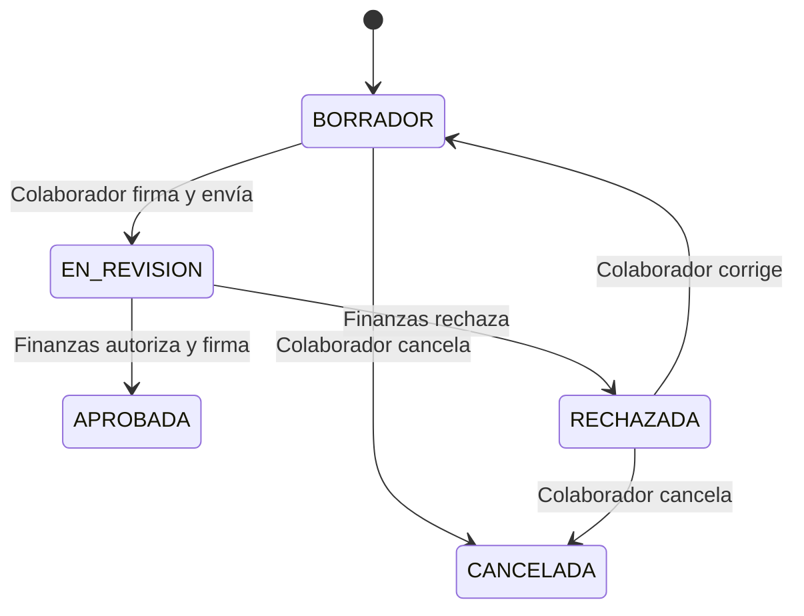

# Etapa 1 — Solicitudes de viáticos

## Objetivo

Implementar el flujo completo de solicitud previa: creación por colaborador, envío firmado, revisión por Finanzas, autorización/rechazo, movimientos y trazabilidad.

## Prerrequisito

La Etapa 0 debe estar implementada y con tests verdes.

## Modelo `solicitudes_viaticos`

Campos sugeridos:

| Campo | Tipo |
|---|---|
| `id` | bigint unsigned |
| `user_id` | FK users |
| `area` | varchar(150) snapshot |
| `puesto` | varchar(150) snapshot |
| `lugar` | varchar(255) |
| `motivo` | text |
| `fecha_inicio` | date |
| `fecha_fin` | date |
| `importe_solicitado` | decimal(12,2) |
| `importe_autorizado` | decimal(12,2), nullable |
| `status` | varchar(30) |
| `version` | unsigned integer, default 1 |
| `motivo_rechazo` | text, nullable |
| `submitted_at` | timestamp, nullable |
| `approved_at` | timestamp, nullable |
| `approved_by` | FK users, nullable |
| timestamps | Laravel |

## Estados

```text
BORRADOR
EN_REVISION
APROBADA
RECHAZADA
CANCELADA
```



## Reglas de negocio

- Solo el propietario modifica una solicitud `BORRADOR`.
- Una solicitud `EN_REVISION` es inmutable para el colaborador.
- Finanzas solo aprueba/rechaza una solicitud `EN_REVISION`.
- El rechazo exige motivo.
- Una solicitud `APROBADA` queda cerrada para edición en el MVP.
- `fecha_fin >= fecha_inicio`.
- `importe_solicitado > 0`.
- `importe_autorizado > 0` al aprobar.
- Solo una solicitud `APROBADA` habilitará la creación de comprobaciones en la Etapa 2.

## Firma electrónica interna

La firma del MVP es una confirmación interna auditable, no una e.firma SAT ni firma avanzada X.509.

Se requieren firmas en:

- envío de solicitud por colaborador;
- aprobación de solicitud por Finanzas.

Tabla genérica `document_signatures`:

- morph `signable_type`, `signable_id`;
- `user_id`;
- `action`: `ENVIO` / `APROBACION`;
- `method`: `INTERNAL_CONFIRMATION`;
- `version`;
- `payload_snapshot json`;
- `content_hash char(64)`;
- `signature_hash char(64)`;
- `ip_address`;
- `user_agent`;
- `signed_at`;
- timestamps.

### Proceso de firma

1. Autorizar con Policy.
2. Solicitar password de confirmación.
3. Validar password con Hash.
4. Generar snapshot canónico del documento.
5. Calcular SHA-256 del snapshot.
6. Calcular sello HMAC con secreto independiente.
7. Guardar firma.
8. Cambiar estado en la misma transacción.
9. Registrar movimiento.

Variable de entorno sugerida:

```text
SIGNATURE_SECRET=
```

Nunca guardar la contraseña.

### Snapshot de solicitud

Debe incluir como mínimo:

- id;
- colaborador;
- área/puesto snapshot;
- lugar;
- motivo;
- fechas;
- importe solicitado;
- importe autorizado cuando aplique;
- versión.

No incluir campos volátiles sin relevancia documental.

## Auditoría

Tabla `solicitud_movimientos`:

- `solicitud_id`;
- `user_id`;
- `action`;
- `from_status`;
- `to_status`;
- `comment`;
- `metadata`;
- `created_at`.

Ejemplos: `CREATED`, `UPDATED`, `SUBMITTED`, `APPROVED`, `REJECTED`, `CANCELLED`, `SIGNED`.

No exponer update/delete funcional de movimientos.

## Policy

### Colaborador

Puede:

- listar/ver únicamente sus solicitudes;
- crear;
- editar `BORRADOR`;
- corregir `RECHAZADA` y regresar a `BORRADOR`;
- cancelar cuando la transición lo permita;
- firmar/enviar propia solicitud.

No puede:

- aprobar;
- modificar solicitud ajena;
- editar `EN_REVISION` o `APROBADA`.

### Finanzas

Puede:

- listar solicitudes en revisión e histórico;
- ver solicitudes;
- aprobar/rechazar `EN_REVISION`;
- consultar firmas y movimientos.

No debe editar silenciosamente datos económicos o descriptivos enviados por el colaborador.

## Endpoints

Colaborador:

```http
GET    /api/v1/solicitudes
POST   /api/v1/solicitudes
GET    /api/v1/solicitudes/{solicitud}
PATCH  /api/v1/solicitudes/{solicitud}
POST   /api/v1/solicitudes/{solicitud}/enviar
POST   /api/v1/solicitudes/{solicitud}/cancelar
GET    /api/v1/solicitudes/{solicitud}/movimientos
GET    /api/v1/solicitudes/{solicitud}/firmas
```

Finanzas:

```http
GET  /api/v1/finanzas/solicitudes
GET  /api/v1/finanzas/solicitudes/{solicitud}
POST /api/v1/finanzas/solicitudes/{solicitud}/aprobar
POST /api/v1/finanzas/solicitudes/{solicitud}/rechazar
```

Aprobar:

```json
{
  "importe_autorizado": 10000.00,
  "password": "confirmacion-del-firmante"
}
```

Rechazar:

```json
{
  "motivo": "Falta justificar el destino del viaje."
}
```

## Actions sugeridas

- `CreateSolicitudAction`
- `UpdateSolicitudAction`
- `SubmitSolicitudAction`
- `ApproveSolicitudAction`
- `RejectSolicitudAction`
- `CancelSolicitudAction`
- `DocumentSnapshotService`
- `DocumentSignatureService`
- `AuditService`

Las transiciones deben usar `DB::transaction()`.

## Events sugeridos

- `SolicitudSubmitted`
- `SolicitudApproved`
- `SolicitudRejected`
- `DocumentSigned`

Los eventos permiten añadir después notificaciones/n8n sin cambiar el Controller.

## Pest obligatorio

- colaborador crea solicitud;
- otro colaborador no puede verla/modificarla;
- Finanzas puede verla;
- no se envía solicitud incompleta;
- envío crea firma y movimiento;
- `EN_REVISION` no se edita;
- Finanzas no aprueba `BORRADOR`;
- aprobación requiere password correcto;
- aprobación genera firma de Finanzas;
- rechazo exige motivo;
- rechazada puede corregirse y reenviarse;
- reenvío incrementa versión y conserva firmas anteriores;
- password incorrecto no genera firma.

## Criterio de aceptación

Desde Postman/Bruno/Insomnia debe poder demostrarse:

1. login como colaborador;
2. crear solicitud;
3. editarla en borrador;
4. firmar y enviar;
5. login como Finanzas;
6. rechazar con motivo o aprobar con importe autorizado y firma;
7. consultar movimientos y firmas históricas.

## Límite de esta etapa

No implementar todavía comprobaciones, gastos, evidencias, OCR ni n8n si el encargo actual se limita a solicitudes.
