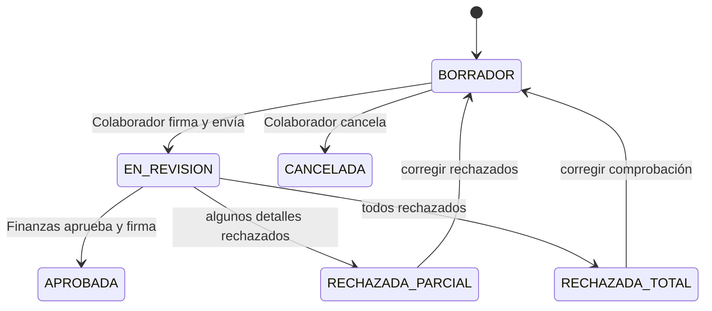

# Etapa 2 — Comprobaciones de viáticos

## Objetivo

Implementar comprobaciones únicamente para solicitudes previamente aprobadas, con relación 1:N, gastos, evidencias, límites, excedentes, revisión parcial/total, firmas y auditoría.

## Prerrequisito

Etapas 0 y 1 completas y probadas.

## Regla principal

```text
Solicitud APROBADA -> puede crear comprobación
Cualquier otro estado -> no puede crear comprobación
```

No implementar reembolso sin solicitud previa.

## Relación

```text
SOLICITUD_VIATICOS 1 ───── N COMPROBACIONES_VIATICOS
                                  │
                                  └──── 1 ───── N DETALLES
                                                   │
                                                   └──── 1 ───── N EVIDENCIAS
```

## Cabecera `comprobaciones_viaticos`

Campos sugeridos:

- `id`;
- `solicitud_id`;
- `user_id`;
- `status`;
- `version` default 1;
- `fecha_comprobacion`;
- `total_importe`;
- `total_iva`;
- `total_retencion`;
- `total_propina`;
- `total`;
- `total_excedente`;
- `observaciones`;
- `motivo_rechazo`;
- `submitted_at`;
- `approved_at`;
- `approved_by`;
- timestamps.

Los totales siempre se recalculan en backend a partir de detalles.

## Estados

```text
BORRADOR
EN_REVISION
APROBADA
RECHAZADA_PARCIAL
RECHAZADA_TOTAL
CANCELADA
```



## Detalles `comprobacion_detalles`

Campos sugeridos:

- `comprobacion_id`;
- `fecha_gasto`;
- `concepto_id`;
- `tipo_comprobante_id`;
- `descripcion`;
- `razon_social`;
- `rfc`;
- `numero_factura`;
- `uuid_cfdi`;
- `importe`;
- `iva`;
- `retencion`;
- `propina`;
- `total`;
- `limite_aplicado` nullable;
- `excedente`;
- `estado_revision`;
- `motivo_rechazo`;
- `revisado_por`;
- `fecha_revision`;
- `origen_captura`;
- `metadata_extraccion json nullable`;
- timestamps.

Estados de revisión:

```text
PENDIENTE
APROBADO
RECHAZADO
```

Origen de captura preparado para futuro:

```text
MANUAL
XML
OCR
```

## Rechazo parcial

Al finalizar revisión:

```text
Todos APROBADO -> APROBADA
Todos RECHAZADO -> RECHAZADA_TOTAL
Mezcla -> RECHAZADA_PARCIAL
```

Cuando el colaborador corrige un detalle rechazado:

- vuelve a `PENDIENTE`;
- limpia motivo de rechazo;
- limpia usuario/fecha de revisión.

Un detalle previamente aprobado no se modifica durante una corrección parcial.

## Evidencias

Tabla `comprobacion_evidencias`:

- `detalle_id`;
- `tipo`;
- `original_name`;
- `stored_name`;
- `disk`;
- `path`;
- `mime_type`;
- `size`;
- `sha256`;
- timestamps.

Tipos iniciales: `XML`, `PDF`, `IMAGEN`, `TICKET`, `OTRO`.

Reglas:

- usar Laravel Storage;
- archivos privados;
- nombre generado UUID/ULID;
- conservar nombre original solo como metadata;
- validar MIME real y tamaño;
- calcular SHA-256;
- descarga protegida por Policy;
- cada detalle necesita al menos una evidencia antes de enviar, salvo futura excepción explícita.

## Límites y excedentes

### Conceptos sin límite

```text
tiene_limite = false
limite_aplicado = null
excedente = 0
```

### Conceptos con límite

Resolver límite por nivel jerárquico del usuario y concepto. Si el concepto distingue comprobante, también por tipo de comprobante.

Si falta una configuración requerida, responder error explícito; no tratarlo como ilimitado.

### Regla anti-fragmentación

Los límites diarios deben acumularse a nivel de **solicitud**, no solamente dentro de una comprobación.

Ejemplo:

```text
Solicitud #150
Límite COMIDA del día = 500
Comprobación A = 300
Comprobación B = 350
Acumulado = 650
Excedente = 150
```

Excedente incremental sugerido:

```text
max(acumulado_con_detalle - limite, 0)
-
max(acumulado_antes_detalle - limite, 0)
```

Nunca generar excedentes negativos.

### Monto autorizado

Para el MVP:

```text
SUM(total de comprobaciones no canceladas) <= importe_autorizado de solicitud
```

Usar transacción y `lockForUpdate` sobre la solicitud cuando sea necesario para evitar concurrencia que exceda el monto autorizado.

## Firma de comprobación

Usar la misma infraestructura `document_signatures` creada en Etapa 1.

Firmas requeridas:

- colaborador al enviar;
- Finanzas al aprobar definitivamente.

Snapshot de comprobación debe contener:

- id y solicitud_id;
- colaborador;
- versión;
- totales;
- todos los detalles;
- concepto/tipo;
- importes;
- límites y excedentes;
- hashes SHA-256 de evidencias.

El rechazo no requiere firma, pero sí auditoría.

## Auditoría

Tabla `comprobacion_movimientos` con estructura equivalente a solicitud.

Acciones ejemplo:

- `CREATED`
- `UPDATED`
- `SUBMITTED`
- `APPROVED`
- `REJECTED`
- `CANCELLED`
- `DETAIL_REJECTED`
- `DETAIL_CORRECTED`
- `EVIDENCE_UPLOADED`
- `SIGNED`

## Endpoints colaborador

```http
GET    /api/v1/comprobaciones
POST   /api/v1/solicitudes/{solicitud}/comprobaciones
GET    /api/v1/comprobaciones/{comprobacion}
PATCH  /api/v1/comprobaciones/{comprobacion}
POST   /api/v1/comprobaciones/{comprobacion}/enviar
POST   /api/v1/comprobaciones/{comprobacion}/cancelar
GET    /api/v1/comprobaciones/{comprobacion}/movimientos
GET    /api/v1/comprobaciones/{comprobacion}/firmas
```

Detalles:

```http
POST   /api/v1/comprobaciones/{comprobacion}/detalles
GET    /api/v1/comprobaciones/{comprobacion}/detalles/{detalle}
PATCH  /api/v1/comprobaciones/{comprobacion}/detalles/{detalle}
DELETE /api/v1/comprobaciones/{comprobacion}/detalles/{detalle}
```

Evidencias:

```http
POST   /api/v1/comprobaciones/{comprobacion}/detalles/{detalle}/evidencias
GET    /api/v1/evidencias/{evidencia}/download
DELETE /api/v1/evidencias/{evidencia}
```

## Endpoints Finanzas

```http
GET  /api/v1/finanzas/comprobaciones
GET  /api/v1/finanzas/comprobaciones/{comprobacion}
POST /api/v1/finanzas/comprobaciones/{comprobacion}/detalles/{detalle}/aprobar
POST /api/v1/finanzas/comprobaciones/{comprobacion}/detalles/{detalle}/rechazar
POST /api/v1/finanzas/comprobaciones/{comprobacion}/finalizar-revision
```

El backend calcula el estado final de la comprobación. El cliente no envía arbitrariamente `APROBADA`, `RECHAZADA_PARCIAL` o `RECHAZADA_TOTAL`.

## Actions/Services sugeridos

- `CreateComprobacionAction`
- `AddDetalleAction`
- `UpdateDetalleAction`
- `UploadEvidenciaAction`
- `SubmitComprobacionAction`
- `ReviewDetalleAction`
- `FinalizeComprobacionReviewAction`
- `CancelComprobacionAction`
- `RecalculateComprobacionTotalsAction`
- `ResolveViaticoLimitService`
- `CalculateExpenseExcessService`
- `ValidateAuthorizedAmountService`

Evitar un `ViaticosService` monolítico.

## Pest obligatorio

Cubrir:

- no crear comprobación desde solicitud no aprobada;
- sí crear desde propia solicitud aprobada;
- relación solicitud 1:N;
- no usar solicitud ajena;
- no superar monto autorizado;
- concurrencia no permite superar monto;
- concepto sin límite → null/0;
- concepto limitado sin configuración → error;
- acumulación por día/concepto/tipo;
- acumulación entre dos comprobaciones distintas de la misma solicitud;
- evidencia propia/ajena;
- no enviar detalle sin evidencia;
- SHA-256 de evidencia;
- revisión por Finanzas;
- rechazo exige motivo;
- parcial/total/aprobada se determina correctamente;
- detalle corregido vuelve a pendiente;
- detalle aprobado no se edita durante corrección parcial;
- envío/aprobación crean firmas;
- reenvío incrementa versión sin borrar firmas históricas.

## Criterio de aceptación

Demostrar:

1. solicitud aprobada existente;
2. crear al menos dos comprobaciones;
3. registrar distintos gastos/evidencias;
4. mostrar límites/excedentes calculados por backend;
5. demostrar anti-fragmentación;
6. firmar/enviar;
7. Finanzas rechaza un gasto y aprueba otro;
8. comprobación queda `RECHAZADA_PARCIAL`;
9. colaborador corrige solo rechazado;
10. reenvía nueva versión;
11. Finanzas aprueba todo y firma;
12. historial conserva movimientos y firmas.
